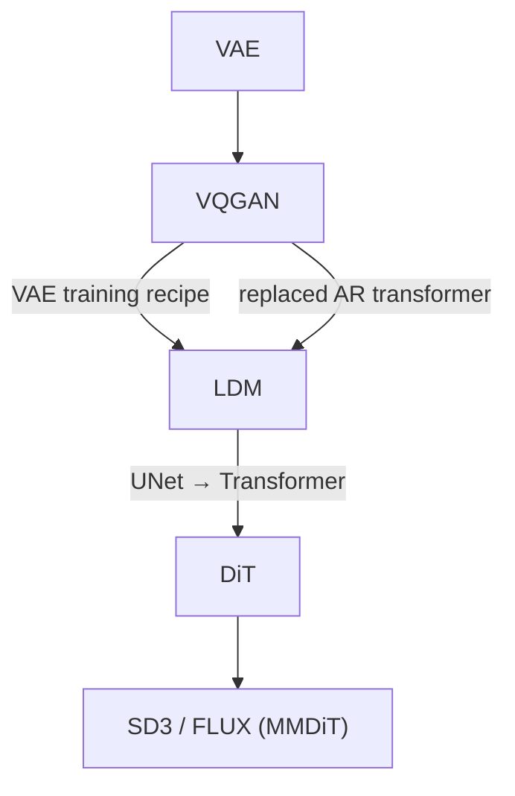

---
aliases:
  - LDM
Arxiv: https://arxiv.org/abs/2112.10752
original title: High-Resolution Image Synthesis with Latent Diffusion Models
year: 2021
date: 2026-05-17
---
---

The following notes comes from my discussion with Claude Sonnet 4.6

---
## Core Idea

Run diffusion in the **latent space of a pretrained autoencoder**, not pixel space.

Images contain large amounts of perceptual redundancy (high-frequency detail). Compress aggressively with a pretrained encoder first, do all the expensive denoising there, then decode back. This gives:

- ~4–8× spatial compression → quadratic cost reduction for attention
- Semantically smoother latent space — easier for the diffusion model to learn
- Clean separation of concerns: VAE handles perceptual compression; diffusion handles semantic generation

> [!tip] The durable contribution
> The paradigm — _VAE first, diffusion on latents_ — is still the foundation of every modern model: DiT, SD3, FLUX, Sora. Nobody does pixel-space diffusion at scale.

---

## Lineage

**What LDM inherited from [[VQGAN]]:**

- The VAE training recipe (perceptual + adversarial + reconstruction + KL)
- The idea of training a generative model on top of latents

**What LDM changed:**

- Replaced VQGAN's autoregressive transformer over VQ tokens with a diffusion model over continuous latents
- Swapped discrete VQ bottleneck for a KL-regularized continuous VAE

---

## Two-Stage Training

Training is **strictly separate** — the VAE is fully trained and frozen before diffusion training begins. No joint training, no shared gradients.

### Stage 1: Train the VAE

Identical to [[VQGAN]]'s recipe. Four loss terms:

$$
\mathcal{L}_\text{VAE} = \mathcal{L}_\text{rec} + \lambda_\text{perc}\mathcal{L}_\text{perc} + \lambda_\text{adv}\mathcal{L}_\text{adv} + \lambda_\text{KL}\mathcal{L}_\text{KL}
$$

|Loss|Purpose|
|---|---|
|L1 reconstruction|Pixel-level fidelity|
|LPIPS (perceptual)|Semantic sharpness via pretrained VGG features|
|PatchGAN adversarial|Local realism; prevents blurring that LPIPS misses|
|KL regularization ($\lambda \sim 10^{-6}$)|Keeps latent magnitude bounded for diffusion; not a tight bottleneck|

#### L1 Reconstruction

Straightforward pixel-level L1 between input $x$ and reconstruction $\hat{x} = \mathcal{D}(\mathcal{E}(x))$. Necessary but insufficient — L1 minimization is equivalent to maximizing a Laplacian likelihood, which averages over uncertainty and produces blurry outputs wherever the decoder is unsure.

#### LPIPS — Learned Perceptual Image Patch Similarity

**Paper:** Zhang et al. 2018, "The Unreasonable Effectiveness of Deep Features as a Perceptual Metric"

**The problem with pixel-space losses:** L1/L2 in pixel space is a poor proxy for perceptual similarity. A 1-pixel spatial shift produces high L2 error but looks identical to a human. Conversely, two images can have low L2 distance but look completely different.

**How it works:** Pass both $x$ and $\hat{x}$ through a pretrained network (VGG or AlexNet), extract intermediate feature maps at multiple layers, compute L2 distance in that feature space, then take a weighted sum across layers:

$$
\mathcal{L}_\text{LPIPS} = \sum_l w_l \| \phi_l(x) - \phi_l(\hat{x}) \|_2^2
$$

The weights $w_l$ are learned on a dataset of human perceptual judgments (humans rating which of two distortions looks more similar to a reference). The intuition: if two images activate the same intermediate CNN features, they look similar to a human — texture, structure, and semantics are captured rather than pixel coincidence.

> [!note]
> LPIPS penalizes semantic deviation well but still allows some blurring — it's computed over spatial averages of feature maps. This is why the adversarial loss is still needed on top.

#### PatchGAN — Patch-Based Adversarial Loss

**Paper:** Isola et al. 2017, "Image-to-Image Translation with Conditional Adversarial Networks" (pix2pix)

**The problem:** A full-image discriminator (real/fake for the whole image) is expensive and gives a single weak gradient signal. It also tends to focus on global structure and ignore local texture.

**How it works:** The discriminator is a fully convolutional network that produces a **spatial grid of real/fake scores**, each score corresponding to a local patch of the input image (e.g. 70×70 pixels). Loss is averaged across all patches:

$$
\mathcal{L}_\text{adv} = \mathbb{E}[\log D(x)] + \mathbb{E}[\log(1 - D(\hat{x}))]
$$

where $D$ outputs a grid, not a scalar. The VAE decoder (generator) must fool **every patch independently** — it cannot hide blurriness in any local region. This specifically targets the high-frequency local texture that L1 and LPIPS both fail to enforce.

> [!tip] Why PatchGAN complements LPIPS
> LPIPS catches semantic/structural deviations. PatchGAN catches local sharpness failures. They cover different failure modes of pure reconstruction losses, which is why both are needed.

The KL weight is intentionally tiny — this is almost a plain autoencoder, not a true [[VAE]] information bottleneck. The goal is well-normalized latents, not compression.

> [!warning] Why not train jointly?
> Diffusion gradients flowing into the encoder would push it toward smooth, easy-to-denoise latents — destroying reconstruction quality. The PatchGAN adversarial training also requires careful balance that external losses would destabilize.

### Stage 2: Train the Diffusion Model

VAE is frozen. Encode each image once: $z = \mathcal{E}(x)$, then train the UNet $\epsilon_\theta$ with standard DDPM noise prediction in latent space. Superseded by [[Flow Matching]].

---

## Conditioning: Cross-Attention

Text injected into the UNet via cross-attention at each resolution level — image features as query, conditioning tokens as key/value. Superseded by joint attention (MMDiT) in SD3/FLUX, where text and image tokens are peers in the same sequence. See [[DiT]].

---

## VQ vs KL: What Actually Shipped

The paper ablates both VQ-regularized and KL-regularized autoencoders. Common confusion: it reads like a VQ-VAE paper but isn't.

|Variant|Bottleneck|Latent type|
|---|---|---|
|VQ-reg|Discrete codebook|Discrete tokens|
|KL-reg|Weak KL penalty|**Continuous**|

**Stable Diffusion (SD 1.x / 2.x) uses the KL-reg variant** — a continuous 4-channel latent at 8× spatial compression. VQ is in the ablations. SD3/FLUX moved to 16-channel continuous latents (still KL-reg, same recipe).

