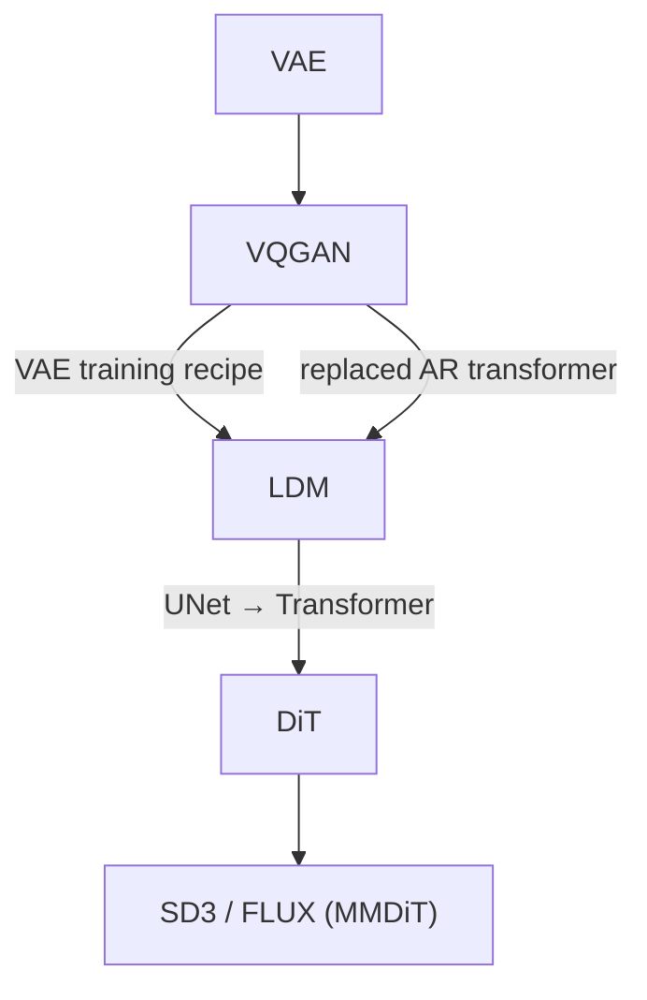

---
aliases:
  - LDM
Arxiv: https://arxiv.org/abs/2112.10752
original title: High-Resolution Image Synthesis with Latent Diffusion Models
year: 2021
date: 2026-05-17
---
---

The following notes comes from my discussion with Claude Sonnet 4.6

---
## Core Idea

Run diffusion in the **latent space of a pretrained autoencoder**, not pixel space.

Images contain large amounts of perceptual redundancy (high-frequency detail). Compress aggressively with a pretrained encoder first, do all the expensive denoising there, then decode back. This gives:

- ~4–8× spatial compression → quadratic cost reduction for attention
- Semantically smoother latent space — easier for the diffusion model to learn
- Clean separation of concerns: VAE handles perceptual compression; diffusion handles semantic generation

> [!tip] The durable contribution
> The paradigm — _VAE first, diffusion on latents_ — is still the foundation of every modern model: DiT, SD3, FLUX, Sora. Nobody does pixel-space diffusion at scale.

---

## Lineage

**What LDM inherited from [[VQGAN]]:**

- The VAE training recipe (perceptual + adversarial + reconstruction + KL)
- The idea of training a generative model on top of latents

**What LDM changed:**

- Replaced VQGAN's autoregressive transformer over VQ tokens with a diffusion model over continuous latents
- Swapped discrete VQ bottleneck for a KL-regularized continuous VAE

---

## Two-Stage Training

Training is **strictly separate** — the VAE is fully trained and frozen before diffusion training begins. No joint training, no shared gradients.

### Stage 1: Train the VAE

Identical to [[VQGAN]]'s four-loss recipe (L1 + [[LPIPS]] + PatchGAN + KL) — see those notes for the details. Two LDM-specific points:

- The KL weight is intentionally tiny ($\lambda \sim 10^{-6}$) — this is almost a plain autoencoder, not a true [[Variational Autoencoder|VAE]] information bottleneck. The goal is well-normalized latents for diffusion, not compression.
- VAE training is fully frozen before diffusion begins. No joint training.

> [!warning] Why not train jointly?
> Diffusion gradients flowing into the encoder would push it toward smooth, easy-to-denoise latents — destroying reconstruction quality. The PatchGAN adversarial training also requires careful balance that external losses would destabilize.

### Stage 2: Train the Diffusion Model

VAE is frozen. Encode each image once: $z = \mathcal{E}(x)$, then train the UNet $\epsilon_\theta$ with standard DDPM noise prediction in latent space. Superseded by [[Flow Matching]].

---

## Conditioning: Cross-Attention

Text injected into the UNet via cross-attention at each resolution level — image features as query, conditioning tokens as key/value. Superseded by joint attention (MMDiT) in SD3/FLUX, where text and image tokens are peers in the same sequence. See [[DiT]].

---

## VQ vs KL: What Actually Shipped

The paper ablates both VQ-regularized and KL-regularized autoencoders. Common confusion: it reads like a VQ-VAE paper but isn't.

|Variant|Bottleneck|Latent type|
|---|---|---|
|VQ-reg|Discrete codebook|Discrete tokens|
|KL-reg|Weak KL penalty|**Continuous**|

**Stable Diffusion (SD 1.x / 2.x) uses the KL-reg variant** — a continuous 4-channel latent at 8× spatial compression. VQ is in the ablations. SD3/FLUX moved to 16-channel continuous latents (still KL-reg, same recipe).

> [!question] With such a weak KL, what stops the latent space from having holes or being unsamplable?
> 
> Nothing — and that's fine. The diffusion model is trained directly on real encoded latents $z = \mathcal{E}(x)$, so it learns $p(z)$ from the actual data distribution, not from a prescribed prior. At generation time it denoises from Gaussian noise *toward wherever the real latents live*, never sampling the VAE latent space arbitrarily. 
> 
> The VAE only needs to satisfy two properties: 
> (1) **reconstructable** — $\mathcal{D}(\mathcal{E}(x)) \approx x$, enforced by the reconstruction + perceptual + adversarial losses; 
> (2) **diffusion-learnable** — smooth and bounded enough for a denoising network to learn the score field over it, which the weak KL (preventing magnitude explosion) and reconstruction losses (enforcing local continuity) together ensure.
>  
> The shape of the distribution is otherwise unconstrained. All generative structure lives in the diffusion model, not the VAE.

