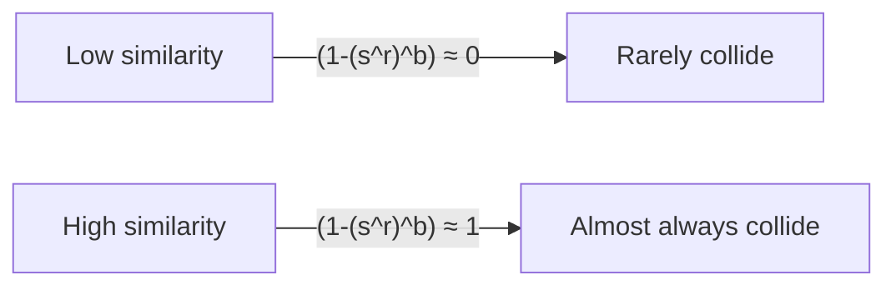

---
aliases:
  - LSH
date: 2026-04-10
---
This note is generated by Claude Sonnet 4.6 based off a conversation.

---

The goal: given a large corpus of documents, find all near-duplicate pairs efficiently — without O(n²) comparisons.

## Estimating [[Jaccard similarity|Jaccard]] from Signatures

Run $k$ independent [[MinHash]] functions. Each document gets a **signature vector** $[h_1(\text{doc}), \ldots, h_k(\text{doc})]$.

For a pair of documents with $M$ agreeing positions and $N$ disagreeing positions ($k = M + N$):

$$
\hat{J} = \frac{M}{M + N}
$$

This is the **sample mean of $k$ i.i.d. Bernoulli($J$) trials**. By the law of large numbers, $\hat{J} \to J$ as $k \to \infty$, with confidence interval:

$$
\hat{J} \pm z \sqrt{\frac{\hat{J}(1-\hat{J})}{k}}
$$

> [!note] Bayesian interpretation
> With a uniform prior on $J$, the posterior given observations $(M, N)$ is:
>
> $$
> J \mid \text{obs} \sim \text{Beta}(M+1,\ N+1)
> $$ 
>
> So $P(J > X \mid \text{obs})$ is just the Beta CDF tail. The MAP estimate recovers $\hat{J} = M/(M+N)$.
> 
> In practice this isn't used — practitioners just threshold on $\hat{J}$ directly — but it's the principled answer to "how uncertain am I?"

## The Search Problem

Even with compact signatures, comparing all pairs is still **O(n²)**. For a million documents that's $5 \times 10^{11}$ comparisons.

MinHash signatures solve the _estimation_ problem. LSH solves the _search_ problem.

## LSH via Banding

Take the length-$k$ signature and divide it into $b$ **bands** of $r$ rows each ($k = b \cdot r$).

For each band, hash that band's chunk into a bucket. Documents sharing a bucket in any band become **candidate pairs**.

### Collision probability

For two documents with true Jaccard similarity $s$:

|Event|Probability|
|---|---|
|Agree on all $r$ rows in one band|$s^r$|
|Collide in at least one of $b$ bands|$1 - (1 - s^r)^b$|

This is the **S-curve**. By tuning $r$ and $b$, you control the threshold (knee of the curve):

$$
s^* \approx \left(\frac{1}{b}\right)^{1/r}
$$



> [!warning] What LSH specifically contributes
> 
> The bucket trick — "only compare pairs sharing a bucket" — is generic and gives you O(n) bucketing + O(candidate pairs) complexity for any hashing scheme.
> 
> What's **specific to LSH** is the design of the hash family that produces the S-curve. A single minHash bucket gives a _linear_ collision probability in $s$ — no sharp threshold. Banding introduces the threshold by:
> 
> - The $r$ exponent (AND over rows) sharpens the lower cutoff
> - The $b$ union (OR over bands) softens the upper end Together they carve out the S-shape.

## The Full Pipeline

```
Documents
  → MinHash signatures (k hashes)     # O(n·k), reduces each doc to a vector
  → LSH banding into buckets          # O(n·b), finds candidate pairs
  → Exact Jaccard on candidates only  # O(|candidates|), verification step
```

The final verification step is where you get certainty. LSH+banding is a probabilistic filter — it trades away some recall (missed pairs) and precision (false candidate pairs) in exchange for massive speedup.

## Parameter Tuning Intuition

|Goal|Adjustment|
|---|---|
|Higher recall (catch more true duplicates)|Increase $b$ (more bands)|
|Higher precision (fewer false candidates)|Increase $r$ (larger bands)|
|Sharper threshold curve|Increase $k = b \cdot r$ overall|
